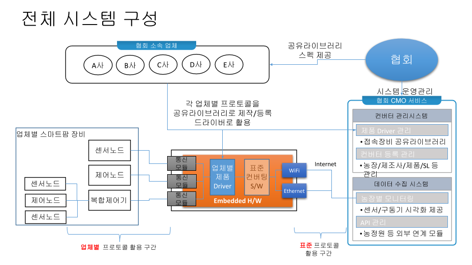

# stdcvt
스마트팜 기기 연동을 위한 컨버터 개발 프로젝트 [ **설계진행중** ]

## 소개
한국 농림수산식품부에서는 스마트팜 기자재 표준화 및 검정제 도입을 준비하고 있다. 현 시점에서 국내에서 개발되어 판매되는 스마트팜 기기들의 표준화는 아직 요원한 상황이다. 이에 (사)한국농식품ICT융복합산업협회에서는 표준화 장비를 중심으로한 주요 스마트팜 기자재의 성능 개선 지원 및 현장생산관리 정보수집 및 활용을 위해 본 프로젝트를 진행하고 있다.

본 프로젝트는 다양한 스마트팜 기기들을 함께 운용하기위한 드라이버를 설계/개발하는 것을 1차 목적으로한다. 부차적으로 해당 드라이버를 실행하기 위한 컨버터, 드라이버를 테스트하기 위한 테스트 UI, 컨버터로부터 데이터를 수집할 수 있는 데이터수집기를 개발한다.

전체 시스템 구성은 아래와 같다. 협회에서 드라이버 제작을 위한 API스펙을 공개하면, 개별업체에서 자사의 기기와 통신할 수 있는 공유라이브러리 형식의 드라이버를 개발하여 제공한다. 컨버터는 제공된 드라이버를 활용하여 서로 다른 업체간 통신을 돕고, 나아가 협회서비스로 데이터를 전송하는 기능을 수행하게 된다.

## 드라이버 개발방식의 장점

드라이버 방식으로 개발하는 경우 다음과 같은 장점이 있다.

1. 참여업체는 내부 프로토콜(혹은 회사 기밀)을 공개할 필요가 없다.
1. 참여업체는 새로운 표준을 직접 구현하지 않기 때문에 작업시간을 단축할 수 있다.
1. 참여업체는 자사의 장비에 컨버터를 설치하지 않기 때문에 안정성문제를 고민할 필요가 없다.
1. 참여업체는 자사의 개발코드를 공개할 필요가 없다. 드라이버만 바이너리 형식으로 제공하면 된다.

이런 장점을 가진 드라이버 개발 방식을 통해 참여업체의 부담을 최소화 하고 스마트팜 기기간의 연동을 이끌어 낼 수 있다.

## 프로젝트 진행 단계

본 프로젝트는 2단계의 진행단계로 계획되고 있다.

1. 기초연동단계 (~2018.07)

   기초연동단계에서는 센서, 구동기(스위치형, 모터형)와의 기초적인 수준에서의 연동을 목표로 한다.

1. 고급연동단계 (~2019.07)

   고급연동단계에서는 개별 장비의 미래지향적 기능(자가진단) 혹은 고급 구동기(양액기)등과의 연동을 목표로 한다.

## 프로젝트 참여사
다음의 업체들이 현재 참여의사를 밝히고 공동 개발을 진행하고 있다. (가나다순)

1. 그리심산업
1. 린캔들라이트
1. 메디앙시스템
1. 제닉스시스템
1. 코리아디지탈

## 프로젝트 문서
프로젝트 진행을 위해 다음과 같은 문서화가 진행되고 있다.

* [컨버터 작동 원리](doc/converter.md)
* [컨버터 사용법](doc/usage_converter.md)
* [샘플노드 사용법](node/README.md)
* [샘플노드 프로토콜](doc/samplenode_protocol.md)

드라이버와 관련된 내용은 [드라이버 저장소](https://github.com/ebio-snu/cvtdriver)를 참고 한다.  

## 개발관련 공통사항
* 라이브러리
  * [google glog](https://github.com/google/glog) : Google 에서 공개한 로깅라이브러리
  * [jsoncons](https://danielaparker.github.io/jsoncons/) : JSON 라이브러리
  * [Boost](http://www.boost.org/) : [asio](https://think-async.com/)와 [dll](http://www.boost.org/doc/libs/1_65_1/doc/html/boost_dll.html)을 주로 사용
  * 개별 드라이버 개발을 위해 필요한 라이브러리를 사용할 수 있다.

* 개발환경
  * g++ : 기본 설정으로 g++을 사용. VC에서 테스트되지는 않았지만 큰 문제는 없을것으로 기대.
  * cmake : 빌드환경
  * nodejs : Test UI를 위한 환경
  * mysql-5.5 : (사용여부 불확실) 데이터저장소를 위한 용도로 활용 예정.

* 개발문서
  * [doxygen](http://www.stack.nl/~dimitri/doxygen/) : 코드 문서화를 위해 활용
