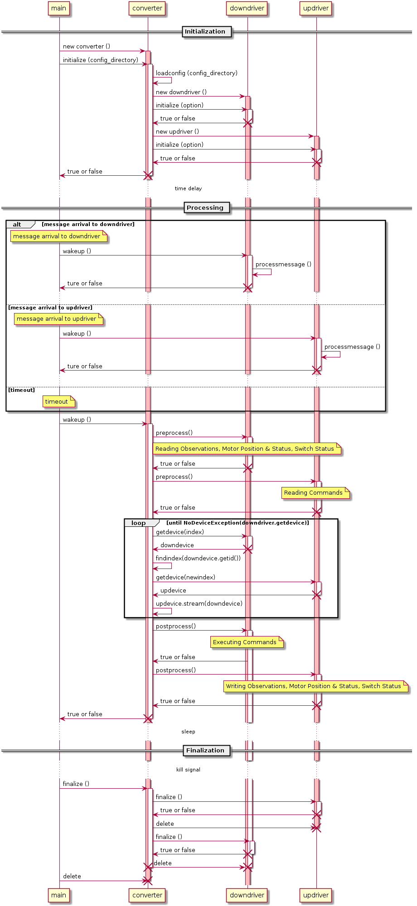
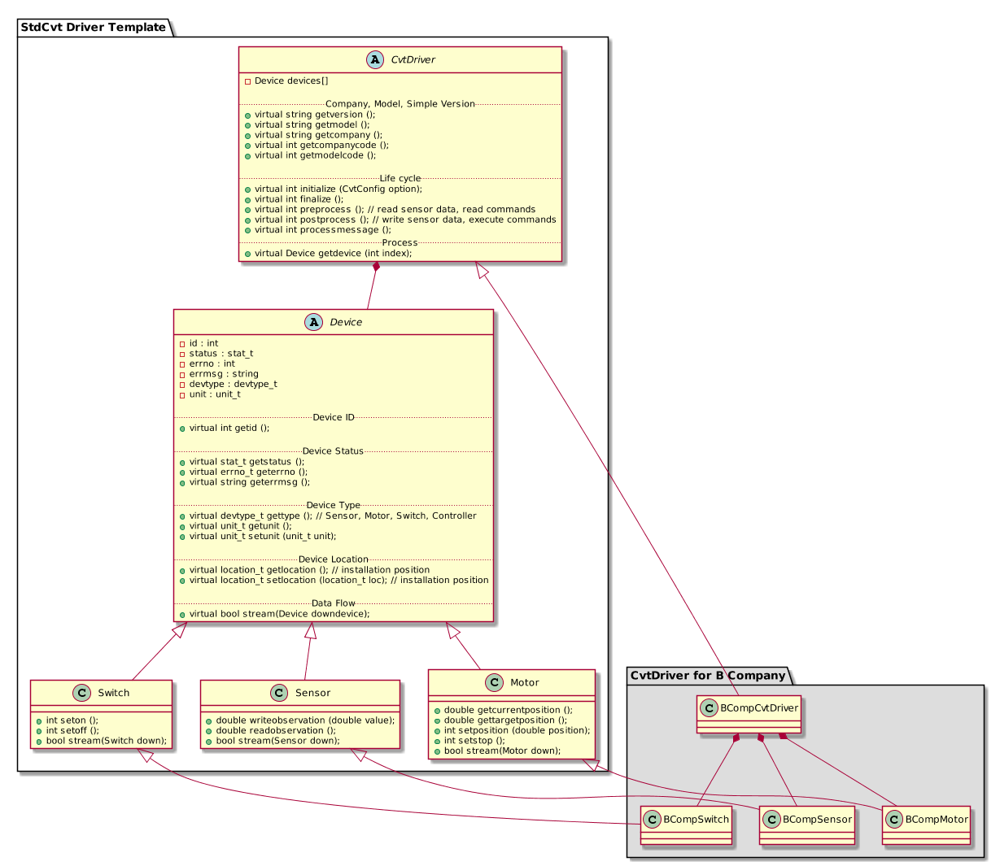

# stdcvt
스마트팜 기기 연동을 위한 컨버터 개발

## 소개
본 프로젝트는 다양한 스마트팜 기기들을 함께 운용하기위한 드라이버를 설계/개발하는 것을 1차 목적으로한다. 부차적으로 해당 드라이버를 실행하기 위한 컨버터, 드라이버를 테스트하기 위한 테스트 UI, 컨버터로부터 데이터를 수집할 수 있는 데이터수집기를 개발한다.

## 스마트팜 기기연동을 위한 컨버터
스마트팜 기기연동을 위한 컨버터는 2개의 드라이버를 활용하여 2개의 네트워크를 연결하는 게이트웨이 역할을 수행하는 장치이다. 드라이버는 센서노드, 제어노드, 컨트롤러와 직접 연결되는 다운드라이버와 데이터 수집기와 연결되는 업드라이버로 구성된다.

다운드라이버와 업드라이버는 동일한 드라이버 API에 의해서 연동되며, 컨버터는 두 드라이버가 가지고 있는 장비의 상태를 교환하는 방식으로 작동한다. 여기서 장비라는 개념이 중요하다.

장비는 다음과 같이 구분된다.
* 센서 : 하나의 관측치를 제공하는 장비. cf. 온습도 센서는 온도 센서, 습도 센서로 구분되어야 한다.
 * 구분될만한 센서가 있다면 추후 하위 카테고리가 생길 수 있음.

* 구동기 : 명령에 의해 어떤 동작을 수행하는 장비.
 * 모터형 구동기 : 열림/닫힘의 방향을 가지고 구동될 수 있는 구동기. % 단위의 제어를 수행함.
 * 스위치형 구동기 : 켜거나 끌 수 있는 구동기.
 * 추후에 양액기 등이 추가될 수 있음.

실제 구성에서는 센서노드, 제어노드, 컨트롤러 등이 다운드라이버와 연결되어 데이터 교환을 하게 되는데, 컨버터는 이를 추상화하여 노드나 컨트롤러의 존재여부에는 관심이 없다.

## 컨버터의 작동시퀀스
컨버터는 업드라이버와 다운드라이버가 가지고 있는 장비들간의 상태 교환을 수행하는데, 개별 드라이버의 구동을 최대한 방해하지 않는 방향으로 작동한다. 컨버터의 작동 프로세스는 다음과 같다.

컨버터는 실행되면 설정파일에 기반해서 업드라이버와 다운드라이버를 생성하고, 각각에 부여된 옵션(설정)정보를 initialize 메소드에 전달한다. 반대로 종료시에는 finalize 메소드를 호출한다.  

실제 연동작업은 프로세싱 과정을 통해서 이루어진다. 다양한 다운드라이버 구현이 있을 수 있기 때문에 프로세싱과정도 다양하게 나타날 수 있다. 컨버터는 비효율적인 방법이지만 일관성있는 방법으로 이를 처리하고자 한다.
1. 컨버터는 다운드라이버와 업드라이버의 상태에 전혀 관여하지 않고, 상태의 교환만을 수행한다.
1. 다운드라이버와 실장비간의 싱크는 다운드라이버내에서 모두 처리한다.
1. 업드라이버와 데이터수집기간의 싱크는 업드라이버내에서 모두 처리한다.
1. 상태의 교환이 이루어지기전 preprocess 메소드가 호출되고, 상태의 교환이 완료된 이후에 postprocess 메소드가 호출된다.
1. (중요) 드라이버에서 대기모드로 돌입하는 것은 불가하다. (sleep, select 등)
1. (논의) 개별 드라이버가 내부적으로 별도의 스레드를 돌리거나 통신을 수행하는 별도의 프로세스를 작동시키고, 내부통신방법(공유메모리 등)을 사용하는 것은 가능하다. 이 경우 전/후처리 메소드(preprocess, postprocess)를 활용하면 된다.
1. (논의) 이벤트라이브러리 (libuv 등)을 활용하여 메세지 처리용 메소드(processmessage)를 호출해주는 방법도 가능하다.

## 드라이버 API
드라이버 API는 별도의 문서를 참고한다.
* [버전0.1]() : 초안
* [버전0.3]() : 개발자 워크샵 수정안
* [버전0.5]() : 기초연동용 API

드라이버 클래스 다이어그램은 다음과 같다.

## 코드표
스마트팜 기기의 원활한 연동을 위해서 별도의 문서를 통해 공통 코드를 공유한다. 해당 문서는 지속적으로 업데이트 될 예정이며, 하위호환성을 최대한 유지할 계획이다. 공통코드는 장비의 상태, 장비의 종류, 장비의 설치위치, 관측치의 단위 등이다.

* [장비 상태](doc/device_status.md)
* [장비 종류](doc/device_type.md)
* [장비 설치위치](doc/device_location.md)
* [관측치 단위](doc/observation_unit.md)
* [에러코드](doc/error_number.md)

## 샘플노드 사용법
앞으로 추가될 예정입니다.
## 테스트용 UI 사용법
앞으로 추가될 예정입니다.

## 드라이버 개발 방법
앞으로 추가될 예정입니다.
### 드라이버 템플릿
앞으로 추가될 예정입니다.

## 컨버터 작동방법
앞으로 추가될 예정입니다.
