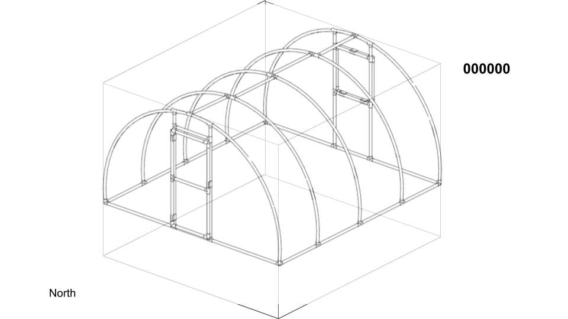
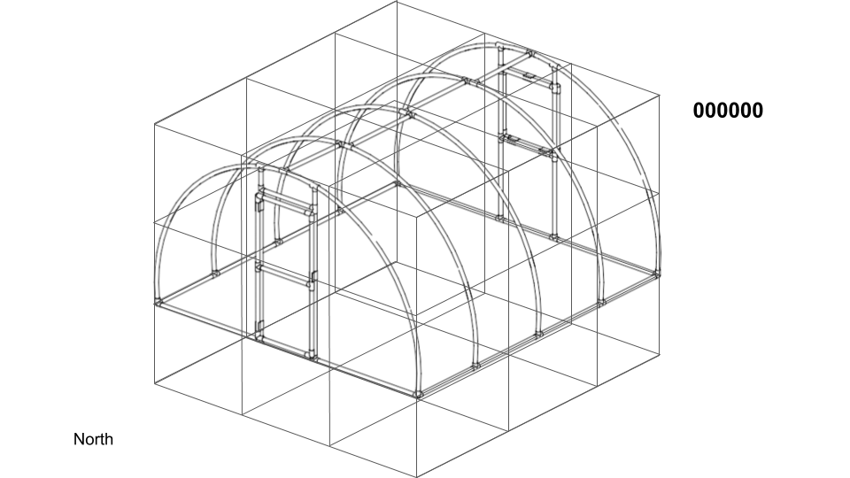

# 장비 설치 구역

장비 설치 구역은 devsec_t 로 표현된다. 장비 설치 구역은 농장을 3차원으로 구분한 구조로 구성된다. 조금 복잡할 수 있다.

농장 구역에 대한 구분값으로 농장 외부는 항상 -1이며, 농장 내부는 0이상의 값이 된다. 이 값은 농장을 x, y, z로 나눈 영역을 기반으로 한다. 각각을 1로 하는 경우 농장 전체가 하나의 영역(1 x 1 x 1)이 된다. 각각을 3 등분하는 경우 농장을 27등분으로 나누는 것이 된다(ex. cubic).

농장 구역의 최소구분은 높이를 3등분하는 것이다. 높이방향으로 지하부, 작물주변, 지상부(작물높이이상)의 3단계로 구분하고, 폭과 길이를 각각 1로 하는 것이 최소구역구분이다.

온실을 예로 설명하면 일반적인 단동온실의 경우 센서를 하나만 설치하는 경우가 일반적이기 때문에 온실내부를 최소 구분단위보다 세분하는 것이 의미가 없다. 이 경우 외부기상대는 구역구분값이 -1, 온실내부 온도센서는 작물주변의 온도를 측정해야 하기때문에 구역구분값을 2로 한다.



단동온실을 폭, 길이, 높이를 모두 3 구역으로 나눈다면 총 27 구역이 된다. 이때 구역구분값은 다음과 같이 처리된다.



번호는 북쪽에 가까운 폭방향의 왼쪽부터 순차적으로 주어진다. 위 예에서는 왼쪽 아래방향이 북쪽방향에 해당한다.

**(구역 번호를 결정하는 순서에 대해서 고민할 필요가 있다. 농장의 방향에 따라 번호순서를 결정?)**

실제적으로 단동온실을 여러구역으로 나누는 경우는 거의 없을 것이다. 연동 온실의 경우 몇개의 센서를 두고 관리하는 경우가 있는데, 이 경우 센서로 구분하고 싶은 구역에 따라서 x, y, z 값을 선정할 수 있다. 3연동 온실에 동별로 센서를 설치한다면 x, y, z 값으로 3, 1, 3을 설정할 수 있을 것이다.


장비 위치는 long int 타입으로 총 12자리 정수를 사용한다. 자리수는 다음과 같다.

| X(폭) | Y(길이) | Z(높이) | 위치번호 |
|:--------:|:--------:|:--------:|:--------:|
| 2 | 2 | 2 | 6 |

다음은 단동온실의 예시이다.

1. 단동온실 내부구역을 구분하지 않아 최소구역단위를 사용한다. (X : 1, Y : 1, Z : 3)
1. 단동온실 외부에 외부기온 측정용 센서가 있다. (위치번호 : 000000)
1. 단동온실 토양에 토양수분 측정용 센서가 있다. (위치번호 : 000001)
1. 단동온실에 내부기온 측정용 센서가 있다. (위치번호 : 010102)
1. 단동온실에 천창이 있다. (위치번호 : 010103)

| X(폭) | Y(길이) | Z(높이) | 위치번호 | **장비설치구역코드** | 비고 |
|--------:|--------:|--------:|--------:|--------|--------|
| 01 | 01 | 03 | 000000 | **010103000000** | 외부기온센서 |
| 01 | 01 | 03 | 010101 | **010103010101** | 토양수분센서 |
| 01 | 01 | 03 | 010102 | **010103010102** | 내부기온센서 |
| 01 | 01 | 03 | 010103 | **010103010103** | 천창위치 |

```
typedef long devsec_t;
```
