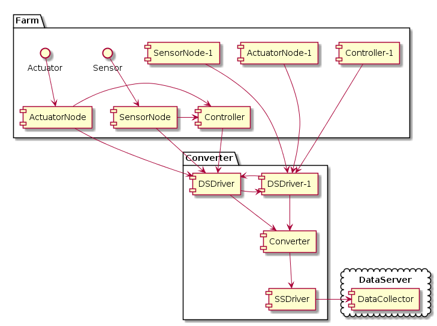
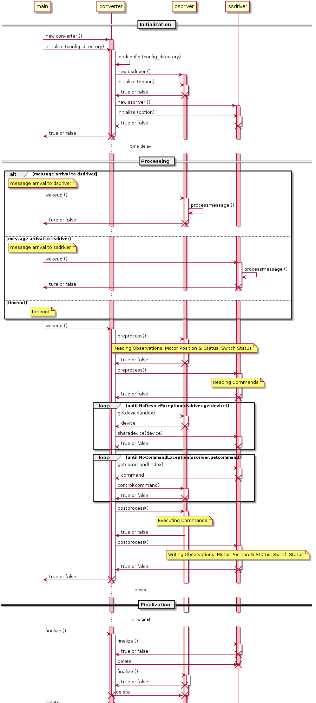

# 스마트팜 기기연동을 위한 컨버터

스마트팜 기기연동을 위한 컨버터는 최소 2개의 드라이버를 활용하여 서로 다른 네트워크를 연결하는 게이트웨이 역할을 수행하는 장치이다. 드라이버는 센서노드, 제어노드, 컨트롤러와 직접 연결되는 장비측(Device Side)드라이버와 데이터 수집기와 연결되는 서버측(Servier Side)드라이버로 구성된다. 각 드라이버를 DSDriver, SSDriver 라고 한다.



DS드라이버와 SS드라이버는 동일한 드라이버 API에 의해서 연동되며, 컨버터는 두 드라이버가 가지고 있는 장비의 상태를 교환하는 방식으로 작동한다.

## 장비의 개념

장비는 다음과 같이 구분된다.
* 센서 : 하나의 관측치를 제공하는 장비. cf. 온습도 센서는 온도 센서, 습도 센서로 구분되어야 한다.
  - 구분될만한 센서가 있다면 추후 하위 카테고리가 생길 수 있음.

* 구동기 : 명령에 의해 어떤 동작을 수행하는 장비.
  - 모터형 구동기 : 열림/닫힘의 방향을 가지고 구동될 수 있는 구동기. % 단위의 제어를 수행함.
  - 스위치형 구동기 : 켜거나 끌 수 있는 구동기.
  - 추후에 양액기 등이 추가될 수 있음.

실제 구성에서는 센서노드, 제어노드, 컨트롤러 등이 DS드라이버와 연결되어 데이터 교환을 하게 되는데, 컨버터는 이를 추상화하여 노드나 컨트롤러의 존재여부에는 관심이 없다.

## 컨버터의 작동시퀀스
컨버터는 SS드라이버와 DS드라이버사이의 상태 교환을 수행하는데, 개별 드라이버의 구동을 최대한 방해하지 않는 방향으로 작동한다. 컨버터의 작동 프로세스는 다음과 같다.



컨버터는 실행되면 설정파일에 기반해서 SS드라이버와 DS드라이버를 생성하고, 각각에 부여된 옵션(설정)정보를 initialize 메소드에 전달한다. 반대로 종료시에는 finalize 메소드를 호출한다.  

실제 연동작업은 프로세싱 과정을 통해서 이루어진다. 다양한 DS드라이버 구현이 있을 수 있기 때문에 프로세싱과정도 다양하게 나타날 수 있다. 컨버터는 비효율적인 방법이지만 일관성있는 방법으로 이를 처리하고자 한다.

1. 컨버터는 DS드라이버와 SS드라이버의 상태에 전혀 관여하지 않고, 상태의 교환만을 수행한다.
1. DS드라이버와 실장비간의 싱크는 DS드라이버내에서 모두 처리한다.
1. SS드라이버와 데이터수집기간의 싱크는 SS드라이버내에서 모두 처리한다.
1. 상태의 교환이 이루어지기전 preprocess 메소드가 호출되고, 상태의 교환이 완료된 이후에 postprocess 메소드가 호출된다.
1. 컨버터에서는 비동기 IO를 지원하기 위해 Boost::asio를 활용한다.
1. (**중요**) Boost::asio를 활용하지 않아도 되지만, 드라이버에서 대기모드로 진입해서는 안된다. (sleep, select 등) 
1. (**논의**) 개별 드라이버가 내부적으로 별도의 스레드를 돌리거나 통신을 수행하는 별도의 프로세스와 내부통신(공유메모리 등)을 수행한다면 해당 스레드나 프로세스에서 대기모드 진입은 가능하다.

## 컨버터의 설치

컨버터는 최대한 특정OS에 종속되지 않도록 개발하려고 한다. 다만, 현 상태에서 사용성, 개별편의 등을 고려하여 라즈베리파이3를 기본 하드웨어로 하고 Raspbian Stretch를 기본OS로 하여 개발을 진행하고 있다. 컨버터의 설치를 위해 라즈베리파이3 및 Raspbian은 설치가 되어 있다고 가정한다.

### 초기 패키지 업데이트
```
sudo apt update
sudo apt upgrade
```

### 필요한 패키지의 설치
* 소스 코드의 획득
```
sudo apt install git
git clone https://github.com/ebio-snu/stdcvt.git
cd stdcvt
git submodule init
git submodule update
```

* Test UI를 위한 NodeJS
```
curl -sL https://deb.nodesource.com/setup_7.x | sudo -E bash -
sudo apt-get install -y nodejs
```

* 빌드를 위한 패키지 설치
```
sudo apt install build-essential cmake libgoogle-glog-dev libasio-dev libjansson-dev libgtest-dev
```

* 소스코드 업데이트 및 빌드
```
cd stdcvt
git pull
git submodule 
mkdir build
cd testui
npm install
cd ../build
cmake ..
make
```

## 컨버터의 설정

컨버터는 json 파일로 된 설정파일에 의해서 설정이 이루어진다. 설정파일은 ssdriver 와 dsdriver 로 나뉘어지는데 기본적인 구조는 동일하다.

```
{ 
    "ssdriver": [{
        "driver": "libsssample.so",
        "option": {
            "value": "value.json",
            "command": "command.json"
        }
    }],
    "dsdriver": [{
        "driver": "libdssample.so",
        "option": {
            "port": "/dev/ttyUSB0",
            "baudrate": 115200
        }
    }]
}
```

하나의 드라이버에 대한 설정은 드라이버 파일명과 해당 드라이버 구동을 위한 옵션으로 구성된다. 드라이버 파일명은 추후 협회의 시스템이 구축될때 내부적인 규칙에 따라 정리될 예정이다. 드라이버의 옵션은 해당드라이버에 맞게 개발자가 설정하면 된다.


