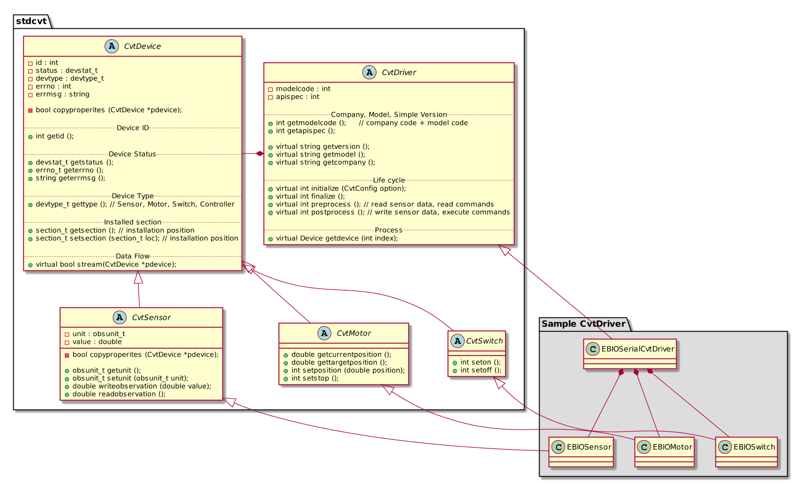

# 드라이버 API

드라이버 API는 기초연동용과 고급연동용으로 구분될 계획이다. 현 단계에서 드라이버는 현상황을 충실히 포함하는쪽으로 설계하는 것을 목표로 하고 있다. 추후에 활성화가 되어 추상화 레벨을 높여서 더 많은 범위를 커버할 수 있기를 바란다.

## 드라이버 API 스펙 문서
현 시점에서 기초 연동을 위한 API 초안이 개발되어 있으며, 참여사와의 워크샵을 통해 기초 연동용 최종안이 개발될 것으로 기대된다.

  1. [기초 연동 API 초안]()
  1. [개발자 워크샵 수정안]()
  1. [기초 연동 API 최종안]() : API 버전 1.00
  1. [고급 연동 API 초안]()
  1. [고급 연동 API 최종안]() : API 버전 2.00

## 드라이버 클래스

드라이버는 CvtDriver 클래스를 상속받아 구현한다.
드라이버 클래스 다이어그램은 다음과 같다.

