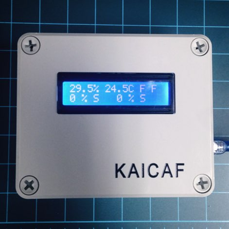

# 샘플 노드 

## 소개
샘플노드는 아두이노 나노, LCD, 온습도센서로 구성된다. 



## 샘플노드 기능
다음과 같은 기능을 가지고 있다.

1. 컨버터와 USB serial 통신을 한다.
1. 습도센서, 온도센서, 그리고  모터와 스위치가 각 두개씩 있다. 
1. 모터와 스위치는 가상으로 동작한다.
1. 습도센서에서 습도값을 읽어서 전송한다.
1. 온도센서에서 온도값을 읽어서 전송한다.
1. 모터는 약1초에 1%씩 움직인다.

## 샘플노드 디스플레이
샘플노드 LCD 는 2줄로 구성되어 있다. 
첫번째 줄에는 습도값, 온도값, 스위치 두개의 상태가 표시된다. 스위치의 상태는 T/F로 표시된다.
두번째 줄에는 두개의 모터상태가 표시된다. 현재 위치(%), 작동상태(O/C/S) 로 표시된다. O : Opening, C : Closing, S : Stopping

## 샘플노드 프로토콜

샘플노드를 만들기위해 간단한 프로토콜을 설계하였다. 

1. 프로토콜은 ^로 시작해서 $로 끝난다.
1. s, m, w 중 하나로 시작한다. s는 센서, m은 모터, w는 스위치를 의미한다.
1. 각각의 값은 스페이스로 구분된다.
1. node->downdriver 로 전송되는 메세지는 다음중 하나이다. devid는 장비아이디, obs는 관측치, status는 장비상태, cmdid는 명령의 아이디, cur의 모터의 현재 위치, target 은 모터의 목표 위치를 의미한다.
  ```
  ^s devid obs status$
  ^m devid cmdid cur target status$
  ^w devid cmdid status$
  ```
1. downdriver->node 로 전송되는 메세지는 다음중 하나이다. 
  ```
  ^m devid cmdid target$
  ^w devid cmdid status$
  ```
1. 메세지를 받으면 확인을 했다는 의미로 ^$를 전송한다.

### 예시
* 센서 메세지 예시 : 10번 센서의 값이 19.6 이고, 정상이다.
```
^s 10 19.6 1$
```
* 모터 메세지 예시 : 20번 모터의 현재 포지션은 10%이고, 20%를 향해서 열리고 있다. 마지막 명령아이디는 3이다.
```
^m 20 3 10 20 1$
```
* 스위치 메세지 예시 : 30번 스위치는 꺼져있다. 마지막 명령아이디는 2이다.
```
^w 30 2 0$
```
* 모터명령 예시 : 20번 모터의 작동을 중지해라. 명령아이디는 1이다.
```
^m 20 1 -1$
```
* 모터명령 예시 : 20번 모터를 10%만큼 열어라. 명령아이디는 1이다.
```
^m 20 1 10$
```
* 스위치명령 예시 : 30번 스위치를 켜라. 명령아이디는 2이다.
```
^w 30 2 1$
```

