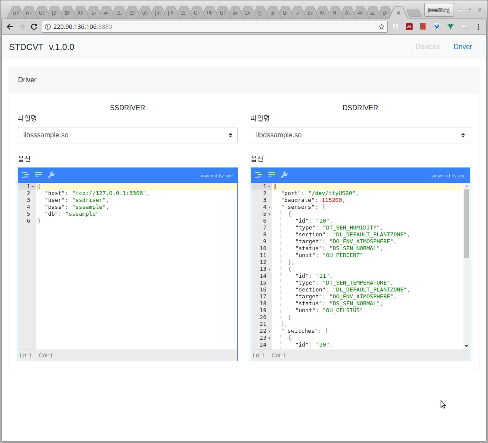
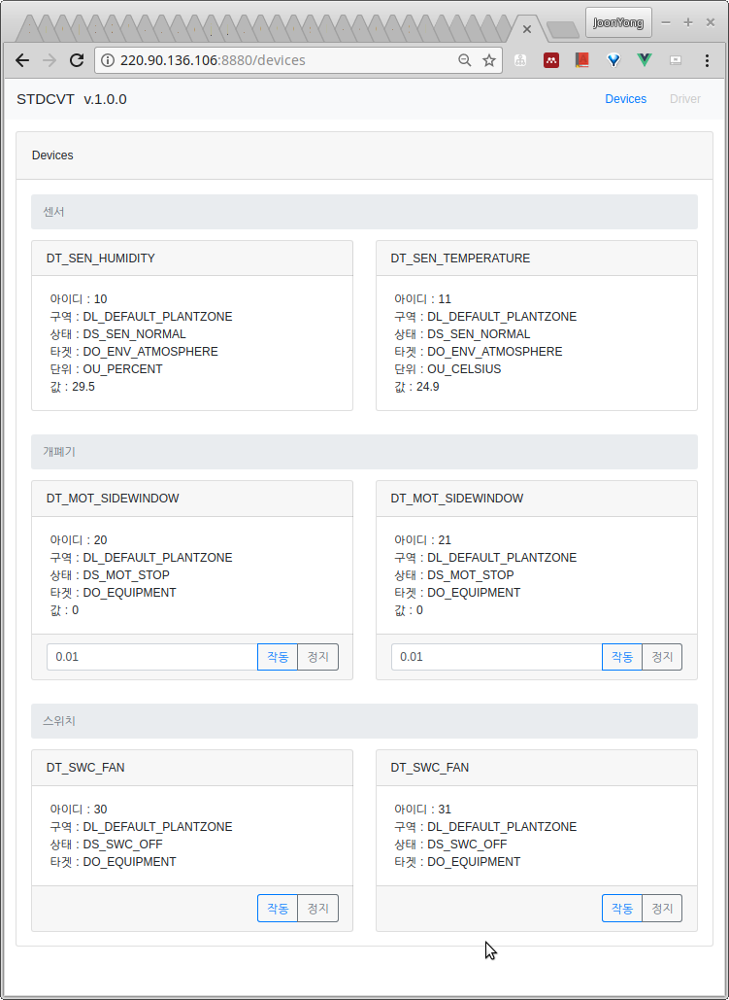

# 컨버터 사용법

## 컨버터 설치
라즈베리파이를 기본으로 하여 설치하는 방법을 설명한다.
설치 절차는 다음과 같다.

1. [raspbian](https://www.raspberrypi.org/downloads/raspbian/) 최신 버전을 설치한다. 데스크탑 버전도 상관없으나 LITE 버전을 추천한다.
1. 설치후 패스워드 변경, SSH 서버 구동, 로케일 설정, 타임존 설정등을 수행한다. 이와 관련해서는 많은 자료가 인터넷 상에 있기때문에 따로 다루지 않는다. 
1. 다음의 명령을 실행하여 필요한 패키지를 설치한다.
```
sudo apt update
sudo apt upgrade -y
curl -sL https://deb.nodesource.com/setup_8.x | sudo -E bash -
sudo apt install -y git buildessential cmake libgoogle-glog-dev libboost-all-dev nodejs libmysqlcppconn-dev mysql-server
```
1. 다음의 명령으로 컨버터 소스를 받는다.
```
git clone https://github.com/ebio-snu/stdcvt.git
cd stdcvt
git submodule init
git submodule update
```
1. 다음의 명령으로 샘플 드라이버를 컴파일 한다.
```
cd cvtdriver
mkdir build
cd build
cmake ..
make
```
1. make test 명령을 통해 샘플 드라이버를 테스트 할 수 있다.

1. 다음의 명령으로 컨버터를 컴파일 한다.
```
cd ../..
mkdir build
cd build
cmake ..
make
```

## 컨버터의 실행
실제 컨버터는 데몬으로 동작하게 되겠지만 드라이버 개발을 위해서 사용하는 경우에는 자주 반복해서 실행해야한다. 이때 다음의 명령으로 실행한다.

```
GLOG_logtostderr=1 ./stdcvt
```

## 테스트용 UI 사용법
테스트용 UI는 nodejs 를 기반으로 작동하며 외부에서 웹브라우저를 통해서 사용할 수 있도록 되어있다.
동작에 필요한 패키지를 설치하기 위해서 testui 폴더에서 다음의 명령을 실행한다.
```
npm install
sudo npm install -g cross-env
```

테스트용 UI를 실행하기 위해 다음의 명령을 실행한다.
```
npm run start
```

테스트용 8880 포트로 접근하면 다음의 화면을 볼 수 있다. 
화면은 driver 와 device로 구분되는데, driver에서는 드라이버 설정을 확인할 수 있고, device 에서는 DSDriver 에서 제공하는 장비 정보를 확인하거나 명령을 전송할 수 있다.




장비정보는 센서, 개폐기, 스위치로 구성되어 있다. 개폐기와 스위치에는 명령을 전달할 수 있는데, 스위치는 단순히 작동/정지를 할 수 있고, 개폐기의 경우 개폐율(소수점 값)을 입력하여 작동할 수 있다. 예를 들어 10%를 열고자 하면 0.1 을 입력하고 작동을 누르면 된다.


